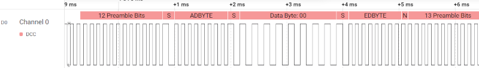
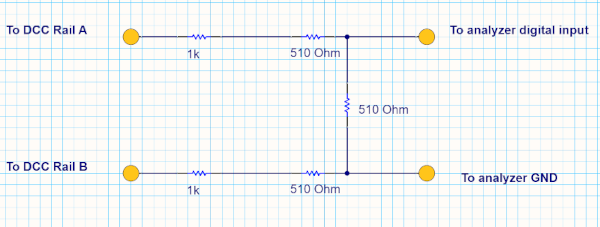

<center>
<br><br>
</center>

# NMRA DCCAnalyzer Plugin v0.0.10

A low level DCC Decoder plugin for Saleae Logic analyzers.  If you own a Saleae Logic 8, Logic Pro 8, or Logic pro 16 analyzer you may install this plugin to display decoded DCC frames above your captured signals.

## Background

If you are a model railroader or a product developer you may find this plugin helpful in discovering what DCC commands are present on your railroad.  The plugin may be used in the following modes:

| Mode | Use Case |
|:----:| :----- |
| Decoder | Timing and protocol is interpreted per NMRA specification for DCC Decoders (default) |
| Cmd Station | The same overall but the perspective of of the command station |
| Service Mode | Service mode commands are interpreted from the decoder perspective |


<br><br>
Decoded DCC may be displayed as shown above, streamed to a terminal, or in table form.  The plugin is available for Windows, Linux, and macOS hosted logic analyzers and works with Saleae Logic 2 software.
<br>

## Quick Start

1. Install Saleae Logic 2 on your computer following Saleae's instructions: https://www.saleae.com/pages/downloads  
2. Download the DCCAnalyzer plugin which is available in the *Releases* section of this repository.  Press the Green *Latest* link on the right side of this page.
3. You only need the file *Analyzer.zip*.  Place this in a temporary folder on your PC.
4. Unzip.  In the unzipped files browse to the directory for your computer's operating system.  There will be only one file there.
5. Copy the file to a permanent location on your computer and remember where you put it.
6. Follow Saleae's instructions to install the plugin. https://support.saleae.com/faq/technical-faq/setting-up-developer-directory

## Connecting to your layout

It is imperative that You familiarize yourself with Saleae Analyzer input specifications, especially for *Supported Voltages* and *Logic Thresholds*. https://support.saleae.com/user-guide.  If you connect your Saleae Analyzer directly to the rails you risk violating the hardware's over voltage protection safety rating.  Furthermore the DCC rails do not share a ground reference with the analyzer.

We recommend using the following resistor network to reduce DCC voltage and to support a *gentle* ground reference for your analyzer.
<br><br>


# For Developers

This section shows you how to download the project files for the DCCAnalyzer Plugin and how to build it.  There are instructions for macOS, Linux, and Windows. 

## MacOS

You may build for X86 based Macintosh versions or Apple's Arm Macs by following these steps.

1. Install XCode with command line tools, available at: https://apps.apple.com/us/app/xcode/id497799835.
2. Then Install command line tools as follows:
```bash
xcode-select --install
```
3. Then open XCode, open Preferences from the main menu, go to locations, and select the only option under 'Command line tools'.
4. Download  the cmake-*-Darwin-x86_64.dmg file: https://cmake.org/download/
5. Double-click the .dmg file to mount it.
6. Drag the CMake application to the Applications folder (or any other desired location).
7. Add CMake to your system's PATH environment variable so you can run it from the command line. This can be done by adding the following line to your .bashrc or .zshrc file:
```bash
export PATH="/Applications/CMake.app/Contents/bin:$PATH"
```

### Building the analyzer

```bash
mkdir build
cd build
cmake ..
cmake --build .
cd Analyzers
install_name_tool -change @executable_path/libAnalyzer.dylib @rpath/libAnalyzer.dylib libdcc_analyzer.so
```

## Ubuntu

Follow these steps to build for Linux Ubuntu
1. Install the latest *build-essential* package as follows:
```bash
* sudo aptitude update
* sudo aptitude install build-essential
```
2. Download the latest CMake for Linux available at: https://cmake.org/download/
3. Download the latest gcc compiler available at: https://gcc.gnu.org.  Note: this should have been installed automatically when *build-essential* was installed.

### Building the analyzer
Open a terminal at the root of the project and execute the following commands:
* mkdir build
* cd build
* cmake ..
* cmake --build .

## Windows
Follow these steps to build DCCAnalyzer plugin for Windows.

1. Install the latest version of Visual Studio Community or Visual Studio Code available at: https://visualstudio.microsoft.com/.  Either will work.
2. Install the latest version of CMake available at: https://cmake.org/download/.
3. Configure Visual Studio for C++ development.  

### Building the analyzer
The first build must be done from the command line.  This build creates a Visual Studio *solutions* file.  Open a terminal in the root of the project and issue the following commands:

```bat
mkdir build
cd build
cmake ..
```
You may continue to build from the command line or, if preferred, use Visual Studio or Visual Studio Code.  In this case open the newly created solution file located in the build directory.

